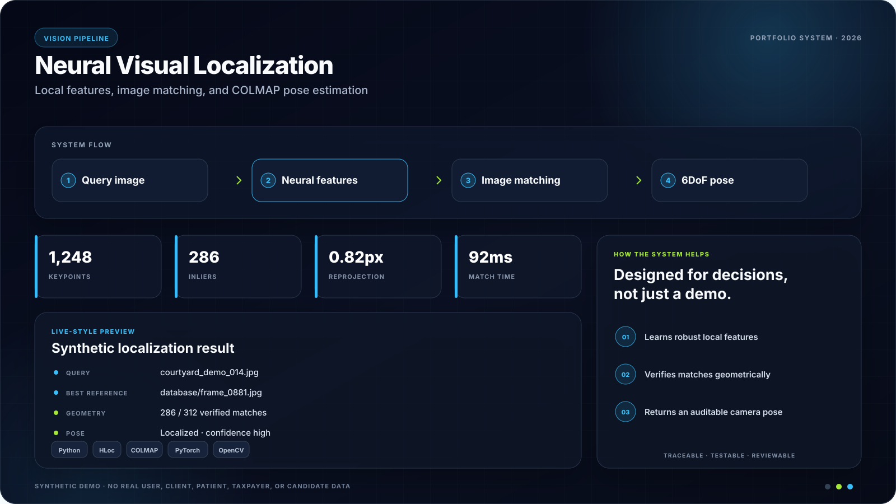

# COLMAP + Hierarchical Localization Workspace


<!-- portfolio-showcase:start -->
<p align="center">
  
</p>
<p align="center"><sub><strong>Portfolio preview:</strong> all names, records, metrics, and scenarios shown above are synthetic. No real user or customer data is included.</sub></p>
<!-- portfolio-showcase:end -->

[](https://github.com/akhil15123/colmap_hloc/actions/workflows/code-quality.yml)

A reproducible computer-vision workspace for extracting local features, matching images, building COLMAP reconstructions, and estimating 6DoF camera poses with Hierarchical Localization (HLoc).


## What is included

- HLoc feature extractors and matchers, including ALIKED, SuperPoint, LightGlue, and SuperGlue
- COLMAP reconstruction, triangulation, and pose-localization utilities
- Notebook pipelines for Aachen, InLoc, and structure-from-motion experiments
- A small Sacré-Cœur image example under `datasets/`
- Portable command-line helpers for localization, feature merging, and matching
- A Docker environment and syntax/notebook validation in GitHub Actions

## Quick start

```bash
git clone --recurse-submodules https://github.com/akhil15123/colmap_hloc.git
cd colmap_hloc
python3 -m venv .venv
source .venv/bin/activate
python -m pip install --upgrade pip
python -m pip install -e .
```

COLMAP must also be installed and available on `PATH`. GPU acceleration is strongly recommended for dense reconstruction and neural feature extraction.

## Portable helper commands

Localize query images against an existing reference reconstruction:

```bash
python localization.py \
  --ref-sfm outputs/reference \
  --query-list inputs/queries.txt \
  --features outputs/features.h5 \
  --matches outputs/matches.h5 \
  --pairs outputs/pairs.txt \
  --results outputs/poses.txt
```

Merge query features into a database feature file:

```bash
python merging.py --database outputs/features.h5 --query outputs/query-features.h5
```

Run matching without machine-specific paths:

```bash
python run_matching.py \
  --pairs outputs/pairs.txt \
  --features outputs/features.h5 \
  --matches outputs/matches.h5 \
  --method aliked+lightglue
```

The bundled notebooks provide longer walkthroughs. Large models and datasets are downloaded by the underlying tools and are intentionally not committed.

## Upstream foundation and license

Most of the `hloc/` package and its research pipelines originate from [CVG's Hierarchical-Localization project](https://github.com/cvg/Hierarchical-Localization), created by Paul-Edouard Sarlin and contributors. This repository adds a COLMAP workspace, datasets, notebooks, and convenience scripts. The upstream Apache 2.0 license is retained in [`LICENSE`](LICENSE).

If you use HLoc in research, follow the citation instructions in the upstream project.
